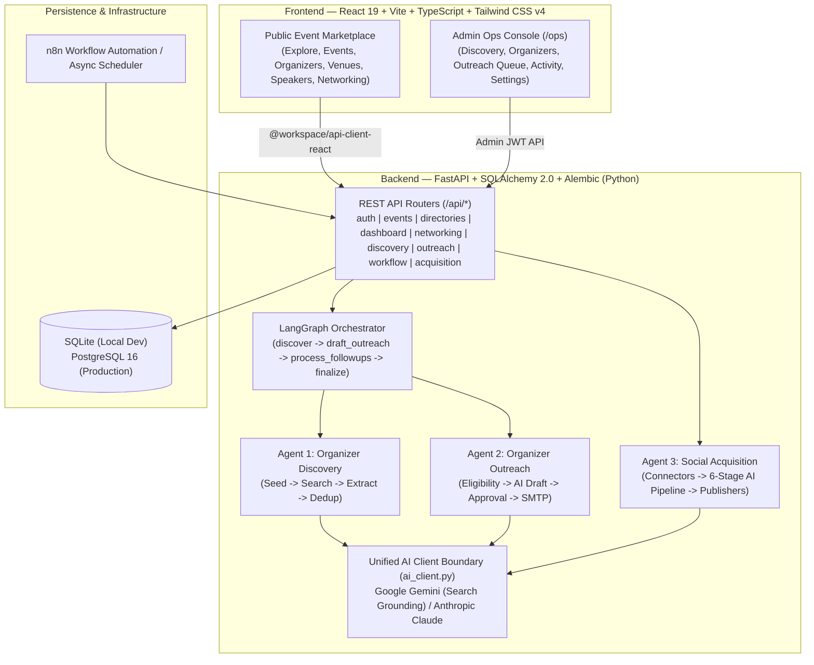

# 100 TIMES — Full-Stack Event Discovery & Autonomous AI Acquisition Platform

**100 TIMES** is a full-stack B2B/B2C event discovery marketplace, attendee networking hub, and autonomous AI-driven growth engine. It combines a modern global event marketplace (conferences, expos, summits, workshops, Organizers, Venues, Speakers, Cities, and Categories) with an integrated suite of **Autonomous AI Agents** orchestrated via **LangGraph**, **Google Gemini / Anthropic Claude**, and **FastAPI** for automated event discovery, organizer outreach, and social media attendee acquisition.

---

## Key Highlights & Core Pillars

### 1. Global Event Discovery Marketplace & Networking Hub
- **Rich Multi-Dimensional Discovery:** Filter and search global events by category, city, format (`In-Person`, `Virtual`, `Hybrid`), date range, and popularity.
- **Comprehensive Directories:** Dedicated detail pages and profiles for **Events**, **Organizers**, **Venues**, **Speakers**, **Cities**, and **Categories**.
- **Role-Based Dashboards:**
  - **Attendee Dashboard:** Track tickets, saved events, reviews, and personalized recommendations.
  - **Organizer Dashboard:** Create and manage events, monitor ticket distribution, view analytics, and track registrations.
  - **Admin Ops Console:** Full command center (`/ops`) for governing AI discovery agents, outreach campaigns, approval queues, and system telemetry.
- **Attendee Networking & AI Concierge:** Built-in attendee matching, networking connection management, and an interactive AI Event Concierge assistant.

### 2. Agent 1 — Autonomous Event & Organizer Discovery (`services/discovery_agent/`)
Automatically discovers upcoming events and their organizers across the web using grounded LLM research and structured extraction:
1. **Query Seed Generation (`query_seeds.py`):** Generates targeted search queries across industries, cities, and formats.
2. **Grounded Web Search (`source_finder.py`):** Uses Google Search grounding (via Gemini) to locate real event pages and organizer websites.
3. **Structured Page Extraction (`page_extractor.py`):** Scrapes and extracts event metadata (title, dates, city, venue, format, ticket URL, confidence score).
4. **Organizer Identification (`organizer_identifier.py`):** Identifies the organizing entity, official domain, and public contact email/channels.
5. **Validation & Deduplication (`validation.py`, `discovery_dedup.py`):** Enforces strict schema validation, filters low-confidence matches, and prevents duplicate entries before persisting `DiscoveredEvent` and `DiscoveredOrganizer` records.

### 3. Agent 2 — Intelligent Organizer Outreach Engine (`services/social_agent/outreach/`)
Automates personalized B2B outreach to newly discovered event organizers with strict human-in-the-loop safety gates:
- **Eligibility & Threshold Gating (`eligibility.py`):** Evaluates match score (`OUTREACH_MATCH_THRESHOLD`) and contact completeness before drafting.
- **Deduplication & Suppression (`duplicate_check.py`, `suppression.py`):** Checks historical campaigns, daily caps (`OUTREACH_DAILY_CAP`), and opt-out/suppression lists.
- **AI Personalized Drafting (`message_generator.py`):** Generates tailored outreach emails referencing the organizer's specific event, audience, and value proposition.
- **Human-in-the-Loop Approval Gate:** All drafted outreach messages enter a review queue in the Admin Ops Console before dispatch via SMTP (`senders/smtp.py`) alongside automated multi-stage follow-ups (`followup.py`).

### 4. Agent 3 — Social Media Attendee Acquisition Pipeline (`services/social_agent/`)
Monitors and engages high-intent community discussions across social platforms to drive tracked attendee registrations:
- **Multi-Platform Connectors (`connectors/`):** Supports **Reddit**, **Discord**, **Telegram**, **X (Twitter)**, **LinkedIn**, and **Instagram** with real-time connector status reporting (`REAL`, `MOCK`, `NOT_CONFIGURED`, `APPROVAL_REQUIRED`).
- **6-Stage Processing Pipeline (`pipeline/`):**
  1. `normalize.py` — Normalizes raw social posts and threads.
  2. `intent_extraction.py` — Uses LLM classification to detect genuine event-seeking or industry networking intent.
  3. `qualification.py` — Scores relevance and filters out spam or low-intent posts.
  4. `event_matching.py` — Matches user intent against active events in the 100 TIMES catalog.
  5. `policy_check.py` — Enforces community compliance, anti-spam rules, and per-platform daily rate limits (`SOCIAL_AGENT_DAILY_CAP_PER_PLATFORM`).
  6. `content_generation.py` — Drafts context-aware replies embedded with short-link attribution URLs (`/r/{id}`).
- **Click & Registration Attribution:** Tracks short-link clicks (`/r/{id}`) through a configurable attribution window (`CLICK_ATTRIBUTION_WINDOW_DAYS=30`) directly to completed event registrations.

### 5. LangGraph Workflow Orchestration (`services/workflow/`)
Unifies Discovery and Outreach into a stateful, checkpointed **LangGraph** state graph (`graph.py`):
- Sequential graph execution: **`discover` → `draft_outreach` → `process_followups` → `finalize`**.
- Equipped with `MemorySaver` state checkpointing, automatic `RetryPolicy` handling, and structured LangChain tools (`tools.py`).
- Optional **n8n workflow definitions** (`infra/n8n/workflows/`) and an in-process async background scheduler (`scheduler.py`) for zero-touch continuous operation.

---

## System Architecture



---

## Tech Stack

| Layer | Technologies |
| :--- | :--- |
| **Frontend** | React 19, TypeScript, Vite, Tailwind CSS v4, Wouter (routing), TanStack React Query, Radix UI, Lucide Icons, Framer Motion, Recharts |
| **Backend API** | Python 3.11+, FastAPI, Uvicorn, Pydantic v2, SQLAlchemy 2.0, Alembic (migrations), JWT (`PyJWT` / `passlib`) |
| **AI & Agent Orchestration** | LangGraph, LangChain Core, Google GenAI SDK (`google-genai` with Google Search grounding), Anthropic SDK (`anthropic`) |
| **Database** | SQLite (zero-config local development with auto-schema & demo seeding) / PostgreSQL 16+ (production parity via Docker Compose) |
| **Monorepo & Tooling** | pnpm Workspaces, Orval (OpenAPI-to-React-Query/Zod code generation), Docker & Docker Compose, n8n workflow definitions, Pytest |

---

## Repository Structure

```text
100-Times-Event-Platform/
├── artifacts/
│   ├── 100-times/                        # React 19 + Vite Frontend (Marketplace + Admin Ops Console)
│   │   ├── src/
│   │   │   ├── App.tsx                   # Public Event Marketplace, Dashboards, Networking & AI Concierge
│   │   │   ├── ops/                      # Modular Admin Ops Console (Discovery, Outreach, Organizers, Settings)
│   │   │   └── components/               # Shared UI component library (Radix + Tailwind)
│   │   └── package.json
│   └── api-server/                       # FastAPI Backend + AI Agent Systems
│       ├── backend/
│       │   ├── core/                     # Config, environment settings, JWT security
│       │   ├── routes/                   # 10 API routers (events, discovery, outreach, workflow, acquisition, etc.)
│       │   ├── services/
│       │   │   ├── discovery_agent/      # Agent 1: Web discovery, page extraction, organizer identification
│       │   │   ├── social_agent/         # Agent 2 (outreach/) & Agent 3 (connectors, 6-stage pipeline, publishers)
│       │   │   └── workflow/             # LangGraph stateful workflow (graph.py, tools.py, llm.py)
│       │   ├── models.py                 # 31 SQLAlchemy ORM models (Marketplace + Discovery + Outreach)
│       │   ├── schemas.py                # Pydantic request/response schemas
│       │   ├── seed.py                   # Rich demo dataset seeder
│       │   └── main.py                   # FastAPI application entrypoint & lifespan manager
│       ├── alembic/                      # Database schema migrations
│       ├── tests/                        # Comprehensive Pytest suite (state machine, agents, routes, dedup)
│       └── .env.example                  # Documented backend environment template
├── lib/
│   ├── api-spec/                         # OpenAPI 3.0 specification (openapi.yaml)
│   ├── api-client-react/                 # Generated React Query hooks & TypeScript API client
│   ├── api-zod/                          # Generated Zod validation schemas
│   └── db/                               # Workspace database schema definitions
├── infra/
│   └── n8n/                              # n8n automation workflows (discovery, processing, publishing, outreach)
├── docker-compose.yml                    # Production-parity stack (PostgreSQL 16 + FastAPI + n8n)
├── start_dev.py                          # One-command Python launcher for Backend (port 8000) + Frontend (port 5174)
└── start.bat                             # Windows one-click development launcher
```

---

## Getting Started (Local Development)

### Prerequisites
- **Python 3.11+**
- **Node.js 20+** and **pnpm** (`npm install -g pnpm`)

### 1. Clone the Repository
```bash
git clone https://github.com/balaji-0001/100-Times-Event-Platform.git
cd 100-Times-Event-Platform
```

### 2. Configure Environment Variables
Copy the example environment file for the backend and add your API keys (all real `.env` files are protected by `.gitignore`):
```bash
cp artifacts/api-server/.env.example artifacts/api-server/.env
```
Key settings in `artifacts/api-server/.env`:
- `DATABASE_URL=sqlite:///./100times-dev.db` *(default zero-setup SQLite database; auto-creates tables and seeds demo data on startup)*
- `AI_PROVIDER=gemini` *(or `anthropic`)*
- `GEMINI_API_KEY=your_gemini_api_key` *(enables live Google Search grounding for Agent 1 & AI drafting for Agent 2)*
- `SMTP_HOST`, `SMTP_PORT`, `SMTP_USERNAME`, `SMTP_PASSWORD` *(optional — falls back to safe `MockEmailProvider` logging if omitted)*

### 3. Install Dependencies
**Backend (Python):**
```bash
cd artifacts/api-server
python -m pip install -r requirements.txt
cd ../..
```

**Frontend (Node / pnpm):**
```bash
pnpm install
```

### 4. Launch the Full Platform
Run the unified launcher from the repository root (or double-click `start.bat` on Windows):
```bash
python start_dev.py
```
Once running, access:
- **Frontend Marketplace & Admin Console:** `http://localhost:5174`
- **FastAPI Backend Server:** `http://127.0.0.1:8000`
- **Interactive Swagger / OpenAPI Docs:** `http://127.0.0.1:8000/docs`

---

## Running with Docker Compose (PostgreSQL + n8n + FastAPI)

To spin up PostgreSQL 16, n8n workflow automation, and the containerized API:
```bash
cp .env.example .env
docker compose up -d
```
- **PostgreSQL 16:** `localhost:5433`
- **n8n Automation UI:** `http://localhost:5678`

---

## Running the Automated Test Suite

The backend includes a comprehensive `pytest` suite covering agent state machines, discovery deduplication, qualification scoring, rate limiting, outreach workflows, and API routes:
```bash
cd artifacts/api-server
pytest
```

---

## Security & Secret Protection
- **Strict `.gitignore` Policy:** All `.env` files, private keys (`*.pem`, `*.key`, `*.crt`, `*.p12`), credential JSONs, local SQLite databases (`*.db`, `*.sqlite*`), and runtime logs are excluded from version control.
- **Human Approval Gates:** Neither the Organizer Outreach Agent nor the Social Acquisition Agent publishes external messages without passing explicit eligibility thresholds, daily rate caps, and approval status checks.
