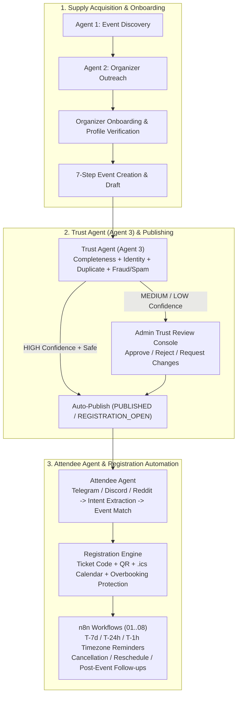

# System Architecture — 100 TIMES Event Platform

## Overview
100 TIMES is an AI-native Event Marketplace, Multi-Agent Operations Platform, and n8n Automation Suite. It connects four autonomous loops:
1. **Agent 1 (Organizer Discovery Agent):** Searches the web to find external events and organizers across India.
2. **Agent 2 (Organizer Outreach Agent):** Invites discovered organizers to list their events on 100 TIMES with human approval and suppression safety.
3. **Trust Agent (Agent 3):** Validates submitted organizer events for completeness, identity verification, duplicate detection, and fraud/spam risk before publishing.
4. **Attendee Agent:** Identifies high-intent event seekers on permitted community sources (Telegram, Discord, Reddit), extracts structured intent (`AttendeeIntent`), matches against published inventory (`EventMatch`), and dispatches personalized recommendations.

## End-to-End Flow

## Key Subsystems
- **State Machine (`backend/services/lifecycle.py`):** Enforces valid transitions across `DRAFT`, `SUBMITTED`, `TRUST_CHECK`, `NEEDS_REVIEW`, `APPROVED`, `PUBLISHED`, `REGISTRATION_OPEN`, `REGISTRATION_CLOSED`, `EVENT_STARTED`, `EVENT_COMPLETED`, `REJECTED`, `CANCELLED`, and `RESCHEDULED`.
- **Idempotency Layer (`AutomationRun`):** Every n8n webhook and automation step is guarded by a unique `idempotency_key` to prevent duplicate emails, tickets, or reminders.
- **Timezone-Aware Scheduling (`backend/services/registration_automation.py`):** Uses `zoneinfo.ZoneInfo` on the event's IANA timezone to compute UTC execution times for `T-7 days`, `T-24 hours`, and `T-1 hour`.
